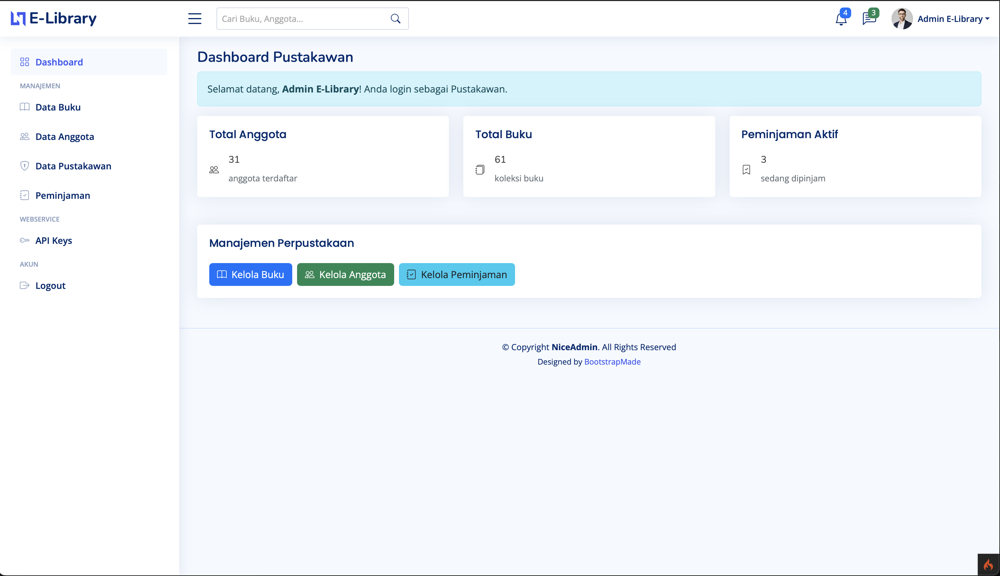
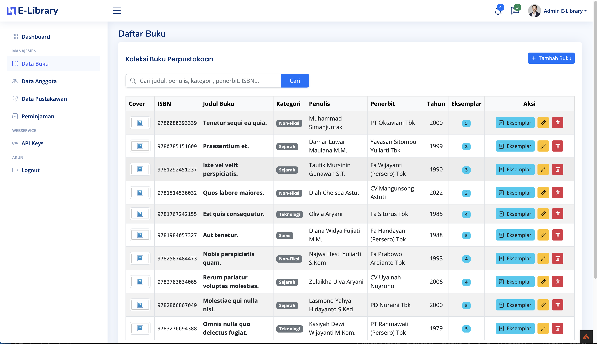
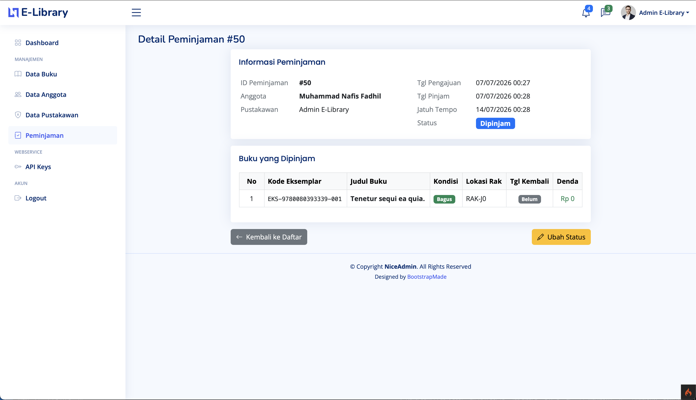
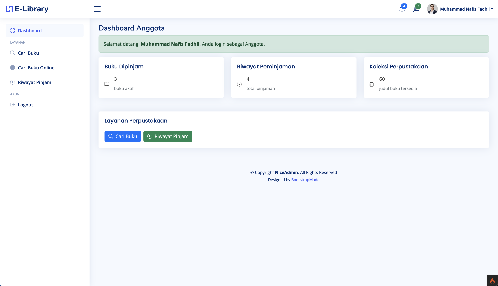

# E-Library (Aplikasi Manajemen Perpustakaan)

Proyek ini adalah aplikasi E-Library berbasis website yang dibangun menggunakan framework CodeIgniter 4. Aplikasi ini memfasilitasi proses peminjaman buku, manajemen anggota, manajemen pustakawan, serta pengelolaan denda.

## 🛠️ Tech Stack
- **Backend Framework:** CodeIgniter 4 (PHP)
- **Database:** MySQL
- **Frontend:** HTML, CSS, JavaScript (termasuk library eksternal jika ada, misal: Bootstrap / Tailwind / NiceAdmin)
- **Package Manager:** Composer

## 📋 Keperluan Instalasi (Prerequisites)
Pastikan sistem Anda sudah memiliki spesifikasi berikut sebelum menjalankan aplikasi:
1. **PHP** versi 8.1 atau lebih baru. Disarankan PHP 8.2+. (Pastikan ekstensi `intl`, `mbstring`, `json`, `mysqlnd`, `curl` aktif).
2. **Composer** versi terbaru.
3. **MySQL Server** (XAMPP, Laragon, MySQL Workbench, dll).
4. **Git** (opsional, untuk proses clone).

## 🚀 Cara Instalasi

1. **Clone Repository**
   Silakan clone repository ini ke dalam direktori lokal Anda (misal `htdocs` untuk XAMPP).
   ```bash
   git clone https://github.com/NafisFadhil/e-library.git
   cd e-library
   ```

2. **Install Dependensi Composer**
   Jalankan perintah berikut di terminal pada direktori proyek untuk menginstal package yang dibutuhkan oleh CodeIgniter 4:
   ```bash
   composer install
   ```

3. **Konfigurasi Lingkungan (.env)**
   * Salin file `.env.example` dan ubah namanya menjadi `.env`.
   * Buka file `.env` menggunakan text editor, lalu atur variabel database sesuai dengan sistem lokal Anda.
   * Pastikan `CI_ENVIRONMENT` diatur ke `development` saat proses development.

   **Contoh Konfigurasi .env:**
   ```env
   CI_ENVIRONMENT = development
   app.baseURL = 'http://localhost:8080/'
   
   database.default.hostname = localhost
   database.default.database = elibrary
   database.default.username = root
   database.default.password = 
   database.default.DBDriver = MySQLi
   ```

4. **Buat Database**
   Buat database baru di MySQL dengan nama `elibrary` (sesuai konfigurasi `.env`).

5. **Jalankan Migrasi & Seeder**
   Proyek ini sudah dilengkapi dengan struktur database (migration) dan data dummy (seeder). Anda wajib menjalankan perintah ini untuk membangun tabel dan mengisi data awal:
   ```bash
   php spark db:seed DatabaseSeeder
   php spark migrate --seed DatabaseSeeder
   ```
   > **Note:** Perintah ini akan menjalankan `DatabaseSeeder` yang secara otomatis mengisi data Buku, Anggota, Pustakawan, Eksemplar, Peminjaman, dll.

6. **Jalankan Aplikasi**
   Setelah semua selesai, jalankan *development server* bawaan CodeIgniter:
   ```bash
   php spark serve
   ```
   Buka browser dan akses URL: `http://localhost:8080`

---

## 👥 Akun Demo

Setelah menjalankan seeder, Anda dapat login menggunakan akun-akun demo berikut:

| Peran | Username / Email | Password | Keterangan |
| :--- | :--- | :--- | :--- |
| **Admin Pustakawan** | `admin` / `admin@elib.com` | `admin123` | Akses penuh (Manajemen Pustakawan, dll) |
| **Pustakawan** | `pustakawan` / `pustakawan@elib.com` | `pustakawan123` | Akses manajemen buku & transaksi |
| **Anggota** | `hastuti.hesti@yahoo.com` | `password123` | Akses frontend (Peminjaman buku, profil) |

> **Tips:** Untuk mengetahui email anggota dummy, silakan cek tabel `anggota` di database Anda setelah seeder berhasil dijalankan.

---

## 🖼️ Screenshot Fitur Utama

*(Silakan ganti URL gambar di bawah ini dengan link screenshot yang sebenarnya sebelum pengumpulan)*

### 1. Dashboard Pustakawan


### 2. Manajemen Buku & Eksemplar


### 3. Proses Peminjaman Buku


### 4. Portal Anggota (Pengajuan Pinjam & Denda)


---

## 📐 Skema Database & Normalisasi

Untuk melihat rancangan database perpustakaan dan tahapan normalisasinya, silakan klik tautan di bawah ini:
*   **[Entity Relationship Diagram (ERD)](docs/ERD%20SBD%20Perpustakaan.png)**
*   **Dokumen Normalisasi Database:**
    *   [First Normal Form (1NF)](docs/1NF.png)
    *   [Second Normal Form (2NF)](docs/2NF.png)
    *   [Third Normal Form (3NF)](docs/3NF.png)

---

## 📄 Dokumentasi API

Aplikasi ini juga menyediakan endpoint RESTful API yang terdokumentasi lengkap:
*   **[Dokumentasi Web Service API](docs/API_DOCUMENTATION.md)**
